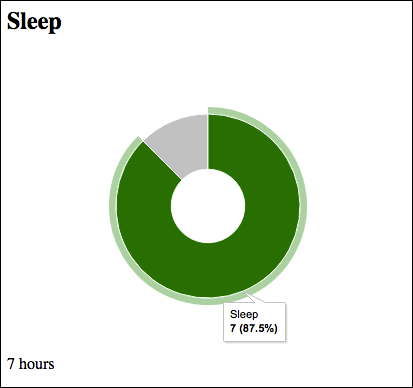

# Bugle Reports Client

### Requirements

You must have access to a [**Bugle Reporting Server**](https://github.com/bazmatic/bugle-reports) to use the Bugle Reports Client

### Install

    $ bower install bugle-reports-client --save

### Usage

**Example**

    
    <link rel="import" href="./bower_components/google-chart/google-chart.html" />
    <link rel="import" href="./bower_components/bugl-reports-client/webcomponents/bugl-sleep-chart/bugl-sleep-chart.html" />

...

    <bugl-sleep-chart color="green" remainder-color="silver" 
                      url="http://URL_OF_BUGLE_REPORTING_SERVER/run/(report_id)?parameters=(params)"></bugl-donut-chart>

